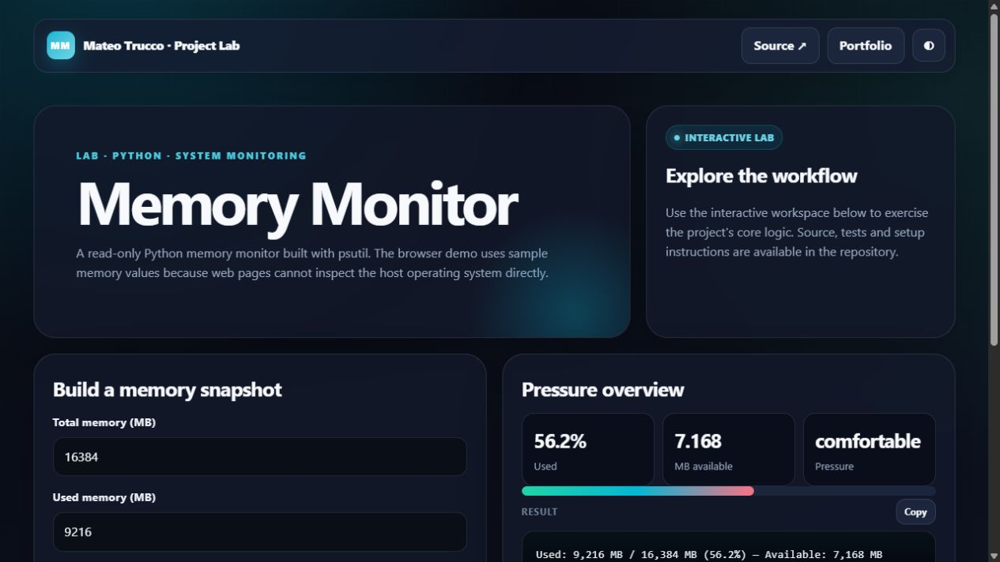

# Memory Monitor

A safe, cross-platform view of current memory usage with pressure classification, workload simulation and a rolling visual history.

The application is intentionally observational: it reports memory pressure without mutating other processes or presenting working-set trimming as optimization.

```bash
pip install psutil
python main.py
```

---

## Interactive preview

[](https://mateotrucco.github.io/memory_monitor/)

**[Open the live experience](https://mateotrucco.github.io/memory_monitor/)** · [View the portfolio](https://mateotrucco.github.io/)

## Engineering baseline

- Business logic separated from presentation
- Automated tests and GitHub Actions CI
- Responsive, keyboard-friendly browser experience
- MIT licensed and documented setup

